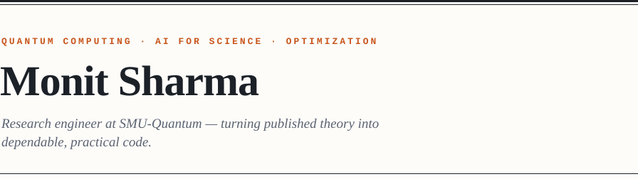

<picture>
  <source media="(prefers-color-scheme: dark)" srcset="assets/masthead-dark.svg">
  
</picture>

  <b><a href="https://monitsharma.github.io/portfolio/">Portfolio ↗</a></b> &nbsp;·&nbsp;
  <b><a href="https://monitsharma.github.io/">Quantum Classroom</a></b> &nbsp;·&nbsp;
  <b><a href="https://orcid.org/0009-0000-7191-5548">ORCID</a></b> &nbsp;·&nbsp;
  <b><a href="https://www.linkedin.com/in/monitsharma/">LinkedIn</a></b> &nbsp;·&nbsp;
  <b><a href="https://medium.com/@_monitsharma">Medium</a></b> &nbsp;·&nbsp;
  <b><a href="https://twitter.com/_MonitSharma">X</a></b> &nbsp;·&nbsp;
  <b><a href="mailto:monitsharma437@gmail.com">Email</a></b>

<table>
<tr>
<td width="62%" valign="top">

## About

I work at the intersection of **quantum computing, optimization, and machine learning** — spanning quantum–classical algorithms, numerical methods, and AI systems applied to scientific problems.

I care about reproducible research, careful benchmarking, and building software that is easy to run, evaluate, and teach. Alongside research, I maintain open educational material to make quantum computing more approachable.

</td>
<td width="38%" valign="top">

## At a glance

`position` &nbsp;Research Engineer, SMU-Quantum  
`degree` &nbsp;&nbsp;&nbsp;M.S. Physics &amp; Data Science, &nbsp;&nbsp;&nbsp;&nbsp;&nbsp;&nbsp;&nbsp;&nbsp;&nbsp;&nbsp;&nbsp;IISER Mohali  
`field` &nbsp;&nbsp;&nbsp;&nbsp;Quantum · AI · HPC

</td>
</tr>
</table>

## Toolbox

|  |  |
| --- | --- |
| `quantum` | Qiskit · PennyLane · Cirq · Amazon Braket · D-Wave |
| `ml` | PyTorch · TensorFlow · scikit-learn · Transformers |
| `systems` | Python · C++ · Rust · CUDA · Linux · Docker |

## Selected repositories

<table>
<tr>
<td width="50%" valign="top">

**[Quantum-Codebooks ↗](https://github.com/MonitSharma/Quantum-Codebooks)**

Solutions and walkthroughs for the major quantum computing platforms — Qiskit, Xanadu, Microsoft Q# and more.

`jupyter` `python`

</td>
<td width="50%" valign="top">

**[Learn-Quantum-Computing-For-Free ↗](https://github.com/MonitSharma/Learn-Quantum-Computing-For-Free)**

A curated collection of free resources for learning quantum computing, maths and physics.

`resources` `curated`

</td>
</tr>
<tr>
<td width="50%" valign="top">

**[Quantum-Papers-Explained-with-Code ↗](https://github.com/MonitSharma/Quantum-Papers-Explained-with-Code)**

Research papers implemented and explained, with companion write-ups on Medium.

`papers` `implementations`

</td>
<td width="50%" valign="top">

**[Qiskit-Summer-School-and-Quantum-Challenges ↗](https://github.com/MonitSharma/Qiskit-Summer-School-and-Quantum-Challenges)**

Notes, lectures and solutions for IBM Qiskit summer schools and quantum challenges, 2020–present.

`qiskit` `challenges`

</td>
</tr>
</table>

## Writing

- **[Medium ↗](https://medium.com/@_monitsharma)** — technical notes on quantum computing, machine learning and scientific computing.
- **[Quantum Classroom ↗](https://monitsharma.github.io/)** — structured tutorials and learning material for quantum computing.
- **[Portfolio ↗](https://monitsharma.github.io/portfolio/)** — selected work, writing and research background.

 

<picture>
  <source media="(prefers-color-scheme: dark)" srcset="assets/colophon-dark.svg">
  
</picture>
