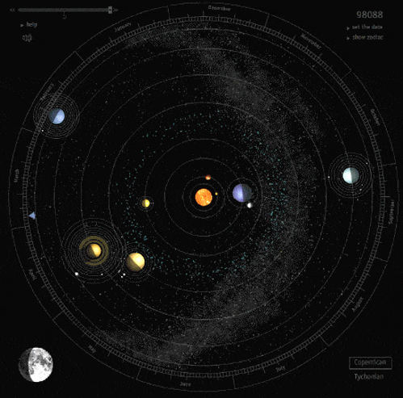

<table>
  <tr>
    <td width="64%" valign="top">
      <h1>Monit Sharma</h1>
      

        <strong>Research Engineer @ SMU-Quantum</strong> 
        Quantum computing | AI for science | Optimization | Scientific computing
      

      

        I build research software, educational resources, and computational experiments across quantum algorithms,
        applied AI, numerical methods, and high-performance scientific workflows.
      

      

        
        
        
        
        
        
      

    </td>
    <td width="36%" align="center">
      
    </td>
  </tr>
</table>

---

### Profile

I work on the bridge between theory and implementation: quantum-classical algorithms, machine learning for scientific problems, optimization methods, and technical education. I care about clear explanations, reproducible notebooks, and code that makes advanced ideas easier to test and teach.

- **Education:** M.S. Physics and Data Science, IISER Mohali
- **Current focus:** AI-assisted scientific workflows, quantum optimization, and research tooling
- **Website:** [monitsharma.github.io/portfolio](https://monitsharma.github.io/portfolio/)

---

### Technical Focus

| Area | Scope |
|---|---|
| **Quantum computing** | QAOA, VQE, quantum circuits, quantum algorithms, and near-term quantum workflows. |
| **Quantum machine learning** | Quantum kernels, data re-uploading, quantum CNNs, noisy-device experiments, and QML tutorials. |
| **Optimization** | Hybrid quantum-classical solvers, numerical optimization, portfolio problems, routing, and combinatorial methods. |
| **AI for science** | Tool-using AI systems for reading, coding, testing, evaluation, and research acceleration. |
| **Scientific computing** | Numerical linear algebra, computational physics, high-energy physics simulations, CUDA, and performance-aware Python/C++ workflows. |

---

### Selected Projects

| Project | Description |
|---|---|
| **[Learn Quantum Computing For Free](https://github.com/MonitSharma/Learn-Quantum-Computing-For-Free)** | Curated free resources for quantum computing, math, physics, and supporting foundations. |
| **[Quantum Machine Learning on Near-Term Quantum Devices](https://github.com/MonitSharma/Quantum-Machine-Learning-on-Near-Term-Quantum-Devices)** | QML projects covering classification, quantum kernels, quantum CNNs, and applied near-term experiments. |
| **[Learn Quantum Machine Learning](https://github.com/MonitSharma/Learn-Quantum-Machine-Learning)** | Hands-on notebooks for learning quantum machine learning through code. |
| **[Quantum Finance and Numerical Methods](https://github.com/MonitSharma/Quantum-Finance-and-Numerical-Methods)** | Python resources for finance, numerical methods, and optimization-oriented workflows. |
| **[Numerical Linear Algebra](https://github.com/MonitSharma/Numerical-Linear-Algebra)** | Notebook-based material for linear algebra, numerical methods, and computational problem solving. |
| **[Quantum Codebooks](https://github.com/MonitSharma/Quantum-Codebooks)** | Walkthroughs and code notebooks for quantum algorithms and online quantum codebook exercises. |
| **[Quantum Classroom](https://monitsharma.github.io/)** | Open learning material for quantum computing, built as a structured classroom-style resource. |

---

### Toolbox

**Quantum:** `Qiskit` `PennyLane` `Cirq` `QuTiP` `Amazon Braket` `pytket` `D-Wave Ocean`

**AI / ML:** `PyTorch` `TensorFlow` `scikit-learn` `MLX` `Transformers`

**Languages:** `Python` `C++` `C` `Rust` `CUDA` `Java` `JavaScript`

**Systems:** `Linux` `Docker` `Git` `Jupyter` `VS Code`

---

### Writing

- [Medium](https://medium.com/@_monitsharma) - technical notes on quantum computing, machine learning, and scientific computing.
- [Quantum Classroom](https://monitsharma.github.io/) - structured quantum computing tutorials and learning resources.
- [Portfolio](https://monitsharma.github.io/portfolio/) - selected work, writing, and research background.

---

### GitHub Snapshot

  
  

---

### Contact

[Email](mailto:monitsharma437@gmail.com) |
[LinkedIn](https://www.linkedin.com/in/monitsharma/) |
[X / Twitter](https://twitter.com/_MonitSharma) |
[Medium](https://medium.com/@_monitsharma) |
[YouTube](https://www.youtube.com/channel/UCZ3bjqNdZsrRacRzSMbzpuQ) |
[LeetCode](https://leetcode.com/monitsharma/)
